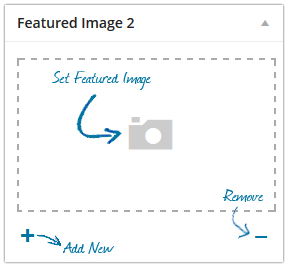
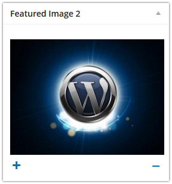
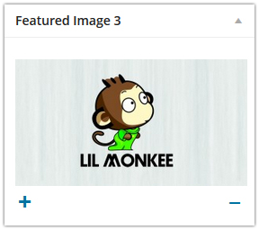

[](https://packagist.org/packages/ankitpokhrel/Dynamic-Featured-Image)
[](https://wordpress.org/plugins/dynamic-featured-image/)
[](https://wordpress.org/plugins/dynamic-featured-image/)
[](https://packagist.org/packages/ankitpokhrel/dynamic-featured-image)

## Dynamic Featured Image (A WordPress Plugin)

> This project is no longer actively maintained.

[](https://wordpress.org/plugins/dynamic-featured-image)
[](https://travis-ci.org/ankitpokhrel/Dynamic-Featured-Image)
[](https://scrutinizer-ci.com/g/ankitpokhrel/Dynamic-Featured-Image/)

_Dynamically adds multiple featured image (post thumbnail) functionality to posts, pages and custom post types._

### Overview
Why limit yourself to only one featured image if you can do some awesome stuffs with multiple featured image? Dynamic Featured Image enables the option to have MULTIPLE featured images within a post or page. It allows you to add different number of featured images to each post and page that can be collected by the various theme functions. This is especially helpful when you use other plugins, post thumbnails or sliders that use featured images.

### Installation

  1. Unzip and upload the `dynamic-featured-images` directory to the plugin directory (`/wp-content/plugins/`) or install it from `Plugins->Add New->Upload`
  2. Activate the plugin through the `Plugins` menu in WordPress.
  3. If you don't see new featured image box, click `Screen Options` in the upper right corner of your wordpress admin and make sure that the `Featured Image 2` box is selected.

### Bower
```
bower install dynamic-featured-image
```

### How it works?
1. After successful plugin activation go to `add` or `edit` page of posts or pages and you will notice a box for second featured image.

  

2. Click `Set featured image` icon, select required image from the "Dynamic Featured Image Media Selector" popup and click `Set Featured Image`.

  

3. Click on `Add New` to add new featured image or use `Remove` link to remove the featured image box.

    
  

4. After adding featured images click `publish` or `update` to save featured images.

###### _Note: The featured images are only saved when you publish or update the post._

### Documentation
* [Retrieving images in a theme](https://github.com/ankitpokhrel/Dynamic-Featured-Image/wiki/Retrieving-data-in-a-theme)
* [Getting image title, alt and caption attributes](https://github.com/ankitpokhrel/Dynamic-Featured-Image/wiki/API-Functions#wiki-getting-image-title-alt-and-caption-attributes)
* [API](https://github.com/ankitpokhrel/Dynamic-Featured-Image/wiki/API)

### Other Resources
* [Blog](https://ankitpokhrel.com/explore/category/dynamic-featured-image/)
* [FAQs](https://wordpress.org/plugins/dynamic-featured-image/faq/)
* [StackOverflow Tag](https://stackoverflow.com/questions/tagged/dynamic-featured-image)

#### List of Available Functions
1. [get_image_id( $image_url )](https://github.com/ankitpokhrel/Dynamic-Featured-Image/wiki/API#wiki-1-get_image_id-image_url-)
2. [get_image_thumb( $image_url, $size = "thumbnail" )](https://github.com/ankitpokhrel/Dynamic-Featured-Image/wiki/API#wiki-2-get_image_thumb-image_url-size--thumbnail-)
3. [get_image_url( $attachment_id, $size = "full" )](https://github.com/ankitpokhrel/Dynamic-Featured-Image/wiki/API#wiki-3-get_image_url-attachment_id-size--full-)
4. [get_post_attachment_ids( $post_id )](https://github.com/ankitpokhrel/Dynamic-Featured-Image/wiki/API#wiki-4-get_post_attachment_ids-post_id-)
5. [is_attached( $attachment_id, $post_id )](https://github.com/ankitpokhrel/Dynamic-Featured-Image/wiki/API#wiki-5-is_attached-attachment_id-post_id-)
6. [get_image_title( $image_url )](https://github.com/ankitpokhrel/Dynamic-Featured-Image/wiki/API#wiki-6-get_image_title-image_url-)
7. [get_image_title_by_id( $attachment_id )](https://github.com/ankitpokhrel/Dynamic-Featured-Image/wiki/API#wiki-7-get_image_title_by_id-attachment_id-)
8. [get_image_alt( $image_url )](https://github.com/ankitpokhrel/Dynamic-Featured-Image/wiki/API-Functions#wiki-8-get_image_alt-image_url-)
9. [get_image_alt_by_id( $attachment_id )](https://github.com/ankitpokhrel/Dynamic-Featured-Image/wiki/API#wiki-9-get_image_alt_by_id-attachment_id-)
10. [get_image_caption( $image_url )](https://github.com/ankitpokhrel/Dynamic-Featured-Image/wiki/API#wiki-10-get_image_caption-image_url-)
11. [get_image_caption_by_id( $attachment_id )](https://github.com/ankitpokhrel/Dynamic-Featured-Image/wiki/API#wiki-11-get_image_caption_by_id-attachment_id-)
12. [get_image_description( $image_url )](https://github.com/ankitpokhrel/Dynamic-Featured-Image/wiki/API#wiki-12-get_image_description-image_url-)
13. [get_image_description_by_id( $attachment_id )](https://github.com/ankitpokhrel/Dynamic-Featured-Image/wiki/API#wiki-13-get_image_description_by_id-attachment_id-)
14. [get_nth_featured_image( $position, $post_id )](https://github.com/ankitpokhrel/Dynamic-Featured-Image/wiki/API#wiki-14-get_nth_featured_image-position-post_id--null-)
15. [get_all_featured_images( $post_id )](https://github.com/ankitpokhrel/Dynamic-Featured-Image/wiki/API#15-get_all_featured_images-post_id-)
16. [get_featured_images( $post_id )](https://github.com/ankitpokhrel/Dynamic-Featured-Image/wiki/API#16-get_featured_images-post_id-)
17. [get_link_to_image( $attachment_id )](https://github.com/ankitpokhrel/Dynamic-Featured-Image/wiki/API#17-get_link_to_image-attachment_id-)

### Allowing DFI only in specific post types
You can use `dfi_post_types` filter to allow DFI only in a specific post types.
```
function allowed_post_types() {
    return array('post'); //show DFI only in post
}
add_filter('dfi_post_types', 'allowed_post_types');
```

### Blocking DFI
Use `dfi_post_type_user_filter` filter to block DFI from post types.
```
function blocked_post_types() {
    return array('page'); //block DFI in page
}
add_filter('dfi_post_type_user_filter', 'blocked_post_types');
```

### Changing the metabox default text
Use `dfi_set_metabox_title` filter to change the metabox default title (Featured Image)
```
function set_metabox_title( $title ) {
    return "My custom metabox title";
}
add_filter('dfi_set_metabox_title', 'set_metabox_title');
```

### Translation Guidelines
All translations live in the `languages` folder.

If you are interested in translating the plugin in your language, first make sure if the translation is not already available. The name of the file is important because there’s a particular format you should follow for consistency. For example, if you’re translating Nepali for Nepal, the file should be `dynamic-featured-image-ne_NP.po` – `dynamic-featured-image` for the plugin itself, `ne` for the language and `NP` for the country.

### Development
1. Install [PHPUnit](https://phpunit.de/) and [composer](https://getcomposer.org/) if you haven't already.
2. Install required dependencies
     ```shell
     $ composer install
     ```
3. Build test using installation script
    ```shell
    $ ./bin/install-wp-tests.sh <test-db-name> <db-user> <db-pass> [db-host] [wp-version] [skip-database-creation]
    ```
4. Run tests with phpunit
    ```shell
    $ ./vendor/bin/phpunit
    ```
5. Validate changes against [WordPress Coding Standards](https://github.com/WordPress-Coding-Standards/WordPress-Coding-Standards)
    ```shell
    $ phpcs <dfi-plugin-dir or filename>
    ```

### Questions about this project?
Please feel free to report any bug found. Pull requests, issues, and plugin recommendations are more than welcome!
